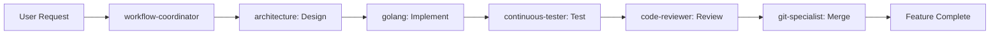
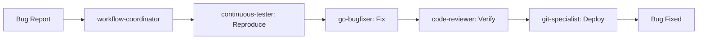
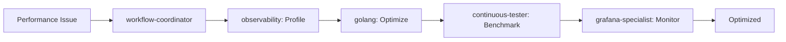

# Agent Workflow Configuration

## Primary Entry Point: workflow-coordinator

The `workflow-coordinator` agent serves as the main orchestrator for all project activities.

## Workflow Hierarchy

```yaml
workflow-coordinator:
  role: "Master Orchestrator"
  model: "sonnet"
  responsibilities:
    - Project management
    - Task delegation
    - Progress tracking
    - Agent coordination

  delegates_to:
    development:
      - golang         # General Go development
      - go-bugfixer    # Bug fixes
      - architecture   # System design

    quality:
      - code-reviewer     # Code quality
      - continuous-tester # Automated testing

    operations:
      - git-specialist      # Version control
      - observability       # Monitoring setup
      - grafana-specialist  # Visualization
```

## Standard Workflows

### 1. Feature Development


### 2. Bug Fix


### 3. Performance Optimization


## Command Routing

### Direct Commands (Bypass Coordinator)
For simple, specific tasks, you can invoke agents directly:
- `/golang` - Direct Go coding
- `/fix-bugs` - Specific bug fix
- `/review-code` - Quick code review

### Coordinator Commands (Complex Tasks)
For multi-step or complex tasks, use the coordinator:
- `/workflow` - Main entry point
- Handles task breakdown
- Manages dependencies
- Coordinates multiple agents

## Agent Communication Protocol

```json
{
  "message_format": {
    "from": "agent_name",
    "to": "agent_name",
    "type": "request|response|notification",
    "priority": "critical|high|normal|low",
    "payload": {
      "task_id": "TASK-001",
      "action": "action_name",
      "data": {},
      "context": {}
    }
  }
}
```

## Task Priority Matrix

| Priority | Response Time | Agents          | Examples                    |
|----------|--------------|-----------------|----------------------------|
| CRITICAL | Immediate    | go-bugfixer     | Production crash, data loss |
| HIGH     | < 1 hour     | golang, tester  | Feature blocking bugs       |
| NORMAL   | < 1 day      | reviewer, arch  | New features, improvements  |
| LOW      | < 1 week     | grafana, git    | Documentation, cleanup      |

## Quality Gates

All work must pass through these gates:

1. **Architecture Review** (for new features)
   - Agent: architecture
   - Checks: Design patterns, scalability

2. **Code Quality**
   - Agent: code-reviewer
   - Checks: Best practices, security

3. **Testing**
   - Agent: continuous-tester
   - Checks: Unit tests, integration, performance

4. **Monitoring**
   - Agent: observability
   - Checks: Metrics, logging, tracing

## Escalation Path

```
Level 1: Individual specialist agent
    ↓ (if blocked or complex)
Level 2: workflow-coordinator
    ↓ (if critical)
Level 3: Human intervention required
```

## Default Workflow Settings

```yaml
defaults:
  max_parallel_tasks: 5
  task_timeout: 30m
  retry_attempts: 3
  quality_threshold: 80%
  test_coverage_min: 70%

  auto_delegate: true
  auto_test: true
  auto_review: true

  notifications:
    on_complete: true
    on_error: true
    on_blocked: true
```

## Usage Examples

### Simple Task (Direct)
```
User: "Fix the race condition in dispatcher.go"
→ /fix-bugs (go-bugfixer handles directly)
```

### Complex Task (Coordinator)
```
User: "Implement complete authentication system"
→ /workflow (workflow-coordinator orchestrates)
  → architecture (designs system)
  → golang (implements)
  → continuous-tester (tests)
  → code-reviewer (reviews)
  → observability (adds monitoring)
  → git-specialist (deploys)
```

## Monitoring Agent Performance

```yaml
metrics:
  per_agent:
    - tasks_completed
    - average_duration
    - success_rate
    - error_count

  workflow:
    - total_workflows
    - average_completion_time
    - bottleneck_detection
    - quality_score
```

## Best Practices

1. **Use workflow-coordinator for**:
   - Multi-step tasks
   - Cross-functional requirements
   - Tasks requiring multiple agents
   - Project planning and tracking

2. **Use direct agents for**:
   - Single-purpose tasks
   - Quick fixes
   - Specialized operations
   - Time-sensitive issues

3. **Always ensure**:
   - Clear task description
   - Success criteria defined
   - Dependencies identified
   - Quality gates enforced

---

## Quick Start

To begin any complex task:
```
/workflow
```

The workflow-coordinator will:
1. Analyze your request
2. Break it into subtasks
3. Delegate to appropriate agents
4. Track progress
5. Report completion

This configuration establishes workflow-coordinator as the primary orchestrator for the log_capturer_go project!