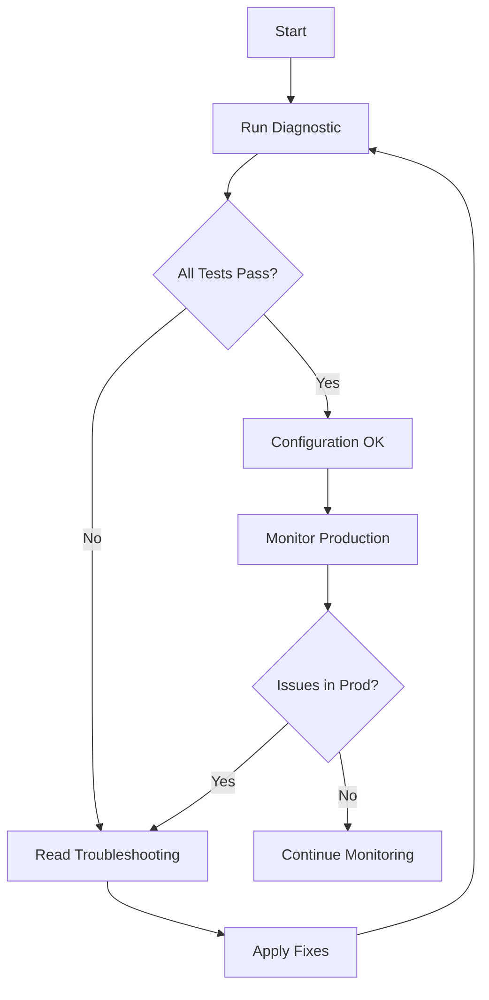

# HTTP Transport Documentation Index

**Purpose**: Central index for all HTTP Transport configuration and diagnostic documentation

---

## Quick Navigation

| Document | Purpose | Use When |
|----------|---------|----------|
| [Quick Reference](HTTP_TRANSPORT_QUICK_REFERENCE.md) | Commands, examples, cheat sheet | Daily development work |
| [Diagnostic Summary](HTTP_TRANSPORT_DIAGNOSTIC_SUMMARY.md) | Verification results | Confirming configuration is correct |
| [Full Analysis](HTTP_TRANSPORT_ANALYSIS.md) | Deep technical analysis | Understanding how it works |
| [Troubleshooting](HTTP_TRANSPORT_TROUBLESHOOTING.md) | Step-by-step problem solving | Fixing issues |
| [Tools README](../tools/README.md) | Diagnostic tools documentation | Running diagnostics |

---

## Document Summaries

### 1. Quick Reference Guide
**File**: `HTTP_TRANSPORT_QUICK_REFERENCE.md`

**What's in it**:
- TL;DR commands for quick checks
- Configuration cheat sheet
- Common scenarios and fixes
- Code examples (correct vs wrong)
- Monitoring commands
- Troubleshooting checklist

**Best for**: Developers who need quick answers

**Key sections**:
- HTTP Transport settings explained
- Goroutine math
- When to adjust MaxConnsPerHost
- Code examples

---

### 2. Diagnostic Summary
**File**: `HTTP_TRANSPORT_DIAGNOSTIC_SUMMARY.md`

**What's in it**:
- Executive summary of diagnostic results
- Test-by-test breakdown
- Pass/fail status for each check
- Recommendations
- Verification checklist

**Best for**: Confirming configuration is working

**Key findings**:
- ✅ MaxConnsPerHost=50 in Loki Sink
- ✅ MaxConnsPerHost=50 in Docker Pool
- ✅ Enforcement verified
- ✅ No goroutine leaks

---

### 3. Full Technical Analysis
**File**: `HTTP_TRANSPORT_ANALYSIS.md`

**What's in it**:
- How MaxConnsPerHost works
- Connection lifecycle explained
- Alternative approaches (if current approach fails)
- Code analysis
- Detailed configuration review

**Best for**: Understanding the internals

**Key topics**:
- Why MaxConnsPerHost matters
- Goroutine leak mechanics
- Alternative implementations
- When to use each approach

---

### 4. Troubleshooting Guide
**File**: `HTTP_TRANSPORT_TROUBLESHOOTING.md`

**What's in it**:
- Step-by-step problem diagnosis
- Specific issues and solutions
- Monitoring commands
- Quick fixes
- When to escalate

**Best for**: Fixing production issues

**Problems covered**:
1. Goroutine count growing
2. High connection count
3. High latency
4. Connection refused errors
5. Memory growth
6. Diagnostic tool failing

---

### 5. Tools Documentation
**File**: `../tools/README.md`

**What's in it**:
- How to run diagnostic tool
- What tests are performed
- Expected output format
- Building and customizing tools

**Best for**: Running diagnostics

---

## File Locations

```
log_capturer_go/
├── docs/
│   ├── HTTP_TRANSPORT_INDEX.md                  ← You are here
│   ├── HTTP_TRANSPORT_QUICK_REFERENCE.md        ← Quick commands
│   ├── HTTP_TRANSPORT_DIAGNOSTIC_SUMMARY.md     ← Test results
│   ├── HTTP_TRANSPORT_ANALYSIS.md               ← Deep dive
│   └── HTTP_TRANSPORT_TROUBLESHOOTING.md        ← Problem solving
├── tools/
│   ├── README.md                                ← Tools docs
│   ├── http_transport_diagnostic.go             ← Diagnostic tool
│   └── run_http_diagnostic.sh                   ← Runner script
└── internal/sinks/
    └── loki_sink.go:111-124                     ← Loki config
```

---

## Common Tasks

### I want to verify configuration is correct

1. Read: [Diagnostic Summary](HTTP_TRANSPORT_DIAGNOSTIC_SUMMARY.md)
2. Run: `./tools/run_http_diagnostic.sh`
3. Check: Status should be PASS

---

### I need to fix a goroutine leak

1. Read: [Troubleshooting Guide](HTTP_TRANSPORT_TROUBLESHOOTING.md) - Problem 1
2. Follow: Step-by-step diagnosis
3. Apply: Recommended fixes
4. Verify: Run diagnostic again

---

### I want to understand how it works

1. Read: [Full Analysis](HTTP_TRANSPORT_ANALYSIS.md)
2. Study: Connection lifecycle section
3. Review: Code examples
4. Explore: Alternative approaches

---

### I need quick commands for monitoring

1. Read: [Quick Reference](HTTP_TRANSPORT_QUICK_REFERENCE.md)
2. Use: Monitoring in Production section
3. Copy: Command templates

---

### I need to adjust MaxConnsPerHost

1. Read: [Quick Reference](HTTP_TRANSPORT_QUICK_REFERENCE.md) - "When to Adjust"
2. Consider: Trade-offs
3. Change: Configuration value
4. Test: Run diagnostic
5. Monitor: Production metrics

---

## Diagnostic Workflow



---

## Key Concepts

### MaxConnsPerHost
- Limits total connections per host
- Prevents unlimited goroutine growth
- Each connection = 2 goroutines
- Default: 0 (unlimited) ❌
- Recommended: 50 ✅

### Connection Pooling
- Reuses TCP connections
- Reduces latency (no handshake)
- Controlled by IdleConnTimeout
- Requires keep-alive enabled

### Goroutine Leak
- Goroutines created but never cleaned
- Caused by unclosed connections
- Detected by rising goroutine count
- Fixed by MaxConnsPerHost + proper cleanup

---

## Configuration Locations

### Loki Sink
**File**: `internal/sinks/loki_sink.go`
**Lines**: 111-124
**Setting**: MaxConnsPerHost=50

### Docker Connection Pool
**File**: `pkg/docker/connection_pool.go`
**Lines**: 279-289
**Setting**: MaxConnsPerHost=50

---

## Diagnostic Tool

### Location
`/home/mateus/log_capturer_go/tools/http_transport_diagnostic.go`

### Run Command
```bash
./tools/run_http_diagnostic.sh
```

### Tests Performed
1. Loki Sink config analysis
2. Docker Pool config analysis
3. MaxConnsPerHost enforcement
4. Connection reuse verification
5. Goroutine leak detection
6. Performance benchmarking
7. Docker client verification (optional)

### Expected Result
```
Overall Status: PASS
Summary: Diagnostic completed: 5 passed, 0 failed, 1 warnings
```

---

## Monitoring Commands

### Check Goroutines
```bash
curl http://localhost:6060/debug/pprof/goroutine?debug=1 | head -1
```

### Check Connections
```bash
netstat -an | grep ESTABLISHED | grep <loki_port> | wc -l
```

### Check Metrics
```bash
curl http://localhost:8001/metrics | grep go_goroutines
```

### Watch Real-Time
```bash
watch -n 1 'curl -s http://localhost:6060/debug/pprof/goroutine?debug=1 | head -1'
```

---

## For New Developers

**Start here**:
1. Read [Quick Reference](HTTP_TRANSPORT_QUICK_REFERENCE.md)
2. Run diagnostic: `./tools/run_http_diagnostic.sh`
3. Review [Diagnostic Summary](HTTP_TRANSPORT_DIAGNOSTIC_SUMMARY.md)
4. Bookmark [Troubleshooting](HTTP_TRANSPORT_TROUBLESHOOTING.md)

**Don't change**:
- MaxConnsPerHost value (unless you know why)
- DisableKeepAlives setting
- ForceAttemptHTTP2 setting

**Always do**:
- Close HTTP response bodies
- Use context with timeout
- Monitor goroutine count

---

## For Operations Team

**Daily monitoring**:
```bash
# Check goroutine count
curl http://localhost:8001/metrics | grep go_goroutines

# Check queue utilization
curl http://localhost:8001/metrics | grep sink_queue_utilization
```

**Weekly verification**:
```bash
# Run full diagnostic
./tools/run_http_diagnostic.sh > reports/diagnostic_$(date +%Y%m%d).json
```

**Alert thresholds**:
- Goroutines > 1000 for 5 minutes
- Queue utilization > 90% for 5 minutes
- HTTP errors > 10/sec for 1 minute

---

## For Code Reviewers

**Check in PRs**:
- [ ] No `http.DefaultClient` usage
- [ ] All HTTP clients have MaxConnsPerHost set
- [ ] All resp.Body.Close() present
- [ ] Contexts used with timeout
- [ ] No DisableKeepAlives=true

**Review checklist** in [Quick Reference](HTTP_TRANSPORT_QUICK_REFERENCE.md)

---

## Additional Resources

### External Links
- [Go http.Transport Docs](https://pkg.go.dev/net/http#Transport)
- [MaxConnsPerHost Source](https://cs.opensource.google/go/go/+/refs/tags/go1.21.0:src/net/http/transport.go;l=167)
- [HTTP Connection Pooling Guide](https://blog.cloudflare.com/the-complete-guide-to-golang-net-http-timeouts/)
- [Goroutine Leak Detection](https://go.uber.org/goleak)

### Internal Documentation
- [CLAUDE.md](../CLAUDE.md) - Developer guide
- [Architecture docs](../docs/)
- [GOROUTINE_LEAK_ANALYSIS.md](GOROUTINE_LEAK_ANALYSIS.md)

---

## Version History

| Date | Version | Changes |
|------|---------|---------|
| 2025-11-06 | 1.0 | Initial documentation |

---

## Maintenance

**Update when**:
- MaxConnsPerHost value changes
- New diagnostic tests added
- Go version updated (affects HTTP behavior)
- New troubleshooting scenarios discovered

**Review frequency**: Quarterly

**Maintainer**: log_capturer_go team

---

**Last Updated**: 2025-11-06
**Status**: Current ✅
